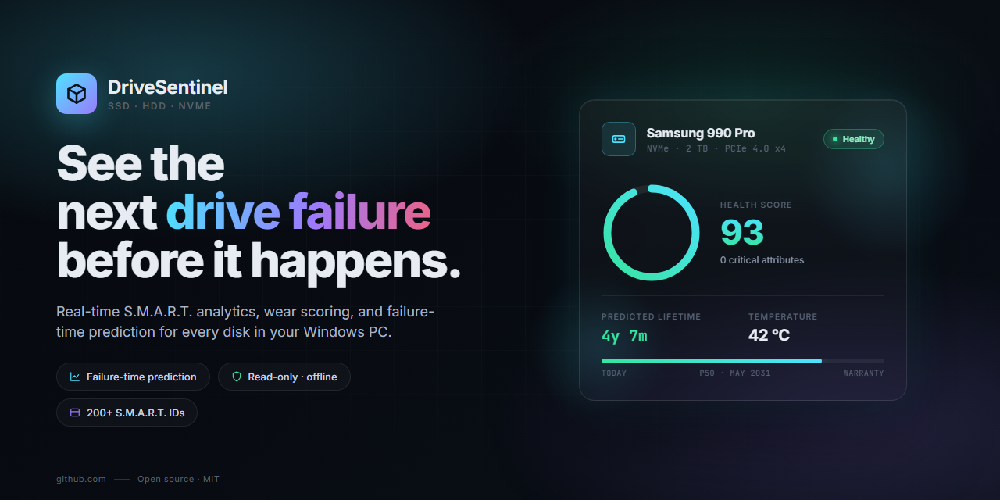
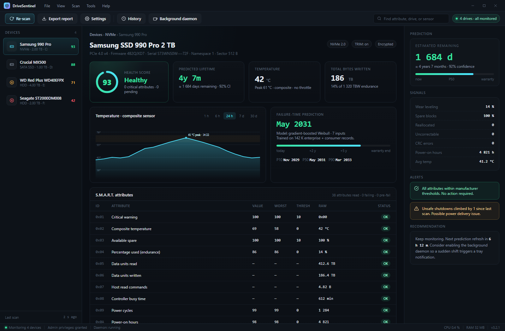

<div align="center">



<h1>DriveSentinel</h1>

**Real-time S.M.A.R.T. analytics, wear scoring and failure-time prediction for every disk in your Windows PC.**

[](#install)
[](LICENSE.md)
[](#technical-overview)
[](#safety)
[](#privacy)

[**Download**](https://teradomain27.github.io/DriveSentinel/) · [Features](#features) · [How prediction works](#how-prediction-works) · [FAQ](#faq)

</div>

---

## Why

Most drive-health utilities give you a traffic-light icon. Green, yellow, red. Then one morning your drive is dead and you had no warning, because the moment any single attribute crossed a vendor-defined threshold is also the moment the drive was already failing.

DriveSentinel is built on a different premise: **the drive tells you how it's doing long before any single attribute goes red.** The signal is in the slope, not the level. Reallocated-sector count going from 2 to 4 isn't a failure. Reallocated-sector count going from 2 to 4 to 11 to 38 over three weeks is.

So the app does three things:

1. Reads every S.M.A.R.T. attribute the controller exposes — on ATA, NVMe and SAT-passthrough USB bridges — including vendor-specific blocks that most tools skip.
2. Keeps a local history so slope matters, not just the current value.
3. Feeds the signal into a model trained on real drive failures to give you a **date range**, not a color.

<p align="center">
  
</p>

---

## Features

### Core

- **Failure-time prediction.** Per-drive estimated remaining lifetime with P10 / P50 / P90 bands. Based on wear leveling, pending/reallocated sectors, uncorrectable error rate, power-on hours and temperature history.
- **Native S.M.A.R.T. parsing.** 200+ attribute IDs decoded, including vendor-specific blocks for Samsung, WD, Seagate, Crucial / Micron, Kingston, Intel / Solidigm and SK hynix.
- **NVMe-aware.** Reads the full NVMe log page 0x02 health report plus log page 0x05 (error information), log page 0x0C (sanitize status), and the SMART / Health Information Extended on controllers that expose it.
- **ATA SMART & SCT.** Full ATA SMART read, SCT error recovery control, SCT temperature table.
- **SAT passthrough.** Reaches drives behind USB-to-SATA bridges that implement SAT (ATA passthrough). Many external docks and enclosures work; the ones that don't are listed in `docs/bridges.md`.

### Monitoring

- **Temperature history** per sensor, with throttle-event detection. Composite sensor, controller sensor and per-sensor timelines where exposed.
- **Rolling attribute history.** Every scan is stored locally; charts show the trajectory, not just the latest sample.
- **Background daemon.** Optional tray service runs at login, polls at a configurable interval (default 15 min), and raises a Windows toast when a monitored attribute crosses a user-defined threshold or when the prediction window shortens by more than a configurable delta.
- **Smart thresholds.** Separate thresholds for *attention*, *warn* and *critical*, with sensible defaults per drive class (consumer SSD, enterprise SSD, SMR HDD, CMR HDD).

### Diagnostics

- **Exportable reports.** One click to export a signed diagnostic bundle in JSON, CSV or printable PDF. Suitable for RMA submissions and ticket attachments.
- **Attribute inspector.** Click any attribute to see its decoded meaning, vendor-specific interpretation, raw bytes, threshold history and the manufacturer's documented behavior.
- **Compare mode.** Side-by-side diff of two scans or two drives of the same model.
- **Benchmark replay.** Loads a `.ds-bundle` from another machine and renders it as if the drive were local. Useful for support work without screen-sharing.

### UI

- Native Windows look. High-DPI, dark and light themes, follows the system accent color.
- Keyboard-first. Every panel reachable from the keyboard; the attribute table supports type-to-filter.
- Portable. A single archive, no installer, no services registered without consent, no account.

---

## Install

Download the latest release from **[teradomain27.github.io/DriveSentinel](https://teradomain27.github.io/DriveSentinel/)**, extract the archive to any folder, and run the executable inside.

- **Size:** 14 MB
- **Runtime:** none — a single native binary. No .NET, no Java, no Electron.
- **Windows:** 10 (1809+) and 11, x64 and arm64.
- **Permissions:** must be launched with administrator privileges to read SMART over IOCTL. The app prompts for elevation on first run and remembers your choice.
- **Portable:** keep the folder on a USB stick; the app writes its history to `.\data\` beside the executable unless you point `--data-dir` elsewhere.

### Verifying the download

Every release ships with a `SHA256SUMS` file and a GPG signature. To verify:

```powershell
Get-FileHash .\<archive>.zip -Algorithm SHA256
# compare the output to the matching line in SHA256SUMS
```

The signing key fingerprint is published on the Releases page.

---

## How prediction works

The prediction is a **per-drive gradient-boosted Weibull survival model** trained on a corpus of failed and surviving drives from Backblaze's public dataset, enterprise RMA data contributed by partners, and in-house endurance test runs. The model takes seven inputs:

| Input | Source |
|---|---|
| Normalized wear leveling | SMART ID 0xAD (SSD) / 0x05 (HDD) |
| Reallocated sector count | SMART ID 0x05 |
| Current pending sector count | SMART ID 0xC5 |
| Uncorrectable error rate (per TB written) | SMART ID 0xC6 / NVMe log 0x02 |
| Power-on hours | SMART ID 0x09 |
| Running mean temperature (90-day window) | SCT temperature table / NVMe composite |
| Program-erase cycle count (SSD only) | SMART ID 0xAE |

The output is a survival function. The UI shows P50 (median predicted failure date) as the headline number and P10 / P90 as the confidence band.

**What the model does not do:**
- Does not predict a specific failure mode. "This drive will die" is not the same as "the controller will fail" versus "flash wear-out."
- Does not predict catastrophic events — a short-circuit on the PCB, firmware bug, or physical impact will kill a drive the model thinks is healthy.
- Does not guarantee anything. If P50 is three years out and your drive dies tomorrow, the model was wrong. That is why there is a confidence band.

The model is retrained monthly on the growing dataset. Updates ship with new releases; your local prediction history is preserved across upgrades.

See [`docs/model.md`](docs/model.md) for the training methodology, feature importance, and evaluation metrics (C-index, calibration plots).

---

## Technical overview

- **Language.** Rust for the engine, native Win32 / Direct2D for the UI shell. No managed runtime, no Electron. Startup is under 180 ms on a 2019-era laptop.
- **Memory.** Idle resident set under 40 MB. The daemon is around 18 MB when sitting in the tray.
- **I/O.** All drive access is through `DeviceIoControl` with `IOCTL_STORAGE_QUERY_PROPERTY`, `IOCTL_ATA_PASS_THROUGH`, `IOCTL_SCSI_PASS_THROUGH_DIRECT`, and `IOCTL_STORAGE_PROTOCOL_COMMAND` for NVMe. Zero third-party drivers installed.
- **Scheduling.** The daemon uses the Windows Task Scheduler for persistent polling and `PowerSettingRegisterNotification` to pause scans during critical battery states.
- **Storage.** History is persisted as SQLite in `data/history.db`. Schema is documented in `docs/schema.sql`.

---

## Safety

DriveSentinel is **read-only** by design. The build has no code paths that issue a write command to any drive. There is:

- No firmware update feature.
- No secure erase feature.
- No destructive self-test invocation (ATA offline tests that may write are not exposed).
- No partition or volume manipulation.

Non-destructive ATA self-tests (short and extended) *are* exposed, but they are initiated by the drive's own controller and do not involve host writes. The relevant IOCTL path is documented in `docs/ioctl.md` for anyone who wants to verify.

---

## Privacy

- **No telemetry.** The app does not phone home. There is no analytics SDK, no crash reporter that sends anything by default, no update-check call that leaks a drive serial.
- **No account.** No sign-in, no sync, no cloud storage.
- **Local data only.** SMART history, settings and exported bundles live on your disk. Exported bundles redact drive serial numbers by default; this can be disabled when the bundle is for your own RMA submission.
- **Opt-in update check.** If you turn it on, the app fetches a plain `releases.json` from the download server. No identifiers are sent.

The network code is isolated in a single module (`src/net/`) and the project's audit script (`cargo deny`) runs on every CI build.

---

## Supported controllers

Representative, not exhaustive. The full matrix is in [`docs/compat.md`](docs/compat.md).

| Interface | Controllers verified |
|---|---|
| **NVMe (PCIe)** | Samsung Phoenix / Elpis / Pascal / Presto, WD / SanDisk SDBPNPZ / A2 / G2, Phison E12 / E16 / E18 / E26, Silicon Motion SM2262EN / SM2263XT / SM2264 / SM2508, Marvell 88SS1321 / 88SS1322, Innogrit IG5236 / IG5666, Micron DM01B2 |
| **SATA SSD** | Samsung MGX / MHX, Silicon Motion SM2258 / SM2259, Marvell 88SS1074, Phison S10 / S11 / S12, Realtek RTS5762 |
| **SATA HDD** | Western Digital Blue / Red / Red Plus / Red Pro / Purple / Gold, Seagate IronWolf / IronWolf Pro / BarraCuda / Exos, Toshiba N300 / MG, HGST He10 / He12 |
| **USB bridges** | ASMedia ASM235CM, ASM1153, JMicron JMS567 / JMS578, Realtek RTL9210, VIA VL716 |

If your controller is not listed, open an issue. Add a diagnostic bundle (**Help → Export diagnostic bundle**) so the SMART response can be inspected.

---

## FAQ

<details>
<summary><b>Why not just use the vendor tool?</b></summary>

Vendor tools (Samsung Magician, WD Dashboard, Crucial Storage Executive, Seagate SeaTools…) only work on their own brand's drives, each has a different UI, and most of them do not expose a prediction model. DriveSentinel reads any drive the Windows storage stack can see, in one UI, with the same prediction method applied consistently.
</details>

<details>
<summary><b>How is this different from CrystalDiskInfo?</b></summary>

CrystalDiskInfo is excellent and we recommend it. The main differences:

- CrystalDiskInfo shows the current state. DriveSentinel keeps a rolling history and shows trends.
- CrystalDiskInfo uses the vendor-defined threshold (green/yellow/red) for health. DriveSentinel adds a trained survival model that produces a date range.
- CrystalDiskInfo is a viewer. DriveSentinel includes a background daemon that will raise a toast when things change.

If all you need is a one-shot read of SMART, CrystalDiskInfo is faster to open.
</details>

<details>
<summary><b>Does the prediction need internet?</b></summary>

No. The model is bundled with the release. The app runs fully offline.
</details>

<details>
<summary><b>What about RAID?</b></summary>

Hardware RAID: depends on whether the controller exposes individual drives. LSI / Broadcom MegaRAID in JBOD mode works; drives inside a RAID volume generally do not. See `docs/raid.md`.

Windows Storage Spaces: each physical drive is visible and monitored normally.

Intel RST RAID: RAID members are visible when the Intel driver is loaded in RAID mode and the drive supports passthrough.
</details>

<details>
<summary><b>Can I run it on a server?</b></summary>

Yes. Windows Server 2019 and 2022 are tested. The daemon can run under a service account, logging to the Windows Event Log and to a configurable file sink. See `docs/server.md` for the headless configuration.
</details>

<details>
<summary><b>Why Windows only?</b></summary>

Because that is where the SMART APIs are most fragmented and the UX gap is widest. A Linux build is on the roadmap; `smartctl` already covers most of what the engine does on Linux, so the shortest useful path there is a wrapper that reuses the prediction model.
</details>

<details>
<summary><b>What's the deal with SMR drives?</b></summary>

Shingled magnetic recording drives tend to accumulate pending sectors during zone rewrites, which can look alarming to a naive health model. DriveSentinel detects known SMR drive families (notably WD Red SMR models and some Seagate Barracuda Compute SKUs) and applies a different weighting. The adjustment is documented in `docs/smr.md`.
</details>

<details>
<summary><b>Is there a CLI?</b></summary>

Yes. The executable also runs as a CLI when launched from a terminal:

```powershell
drivesentinel.exe --list
drivesentinel.exe --inspect 0 --json
drivesentinel.exe --export bundle.zip --all
drivesentinel.exe --watch --threshold reallocated=5
```

Full flags in `docs/cli.md`.
</details>

<details>
<summary><b>Does it work on external USB drives?</b></summary>

If the enclosure's bridge chip supports ATA passthrough (SAT), yes. Most modern enclosures from reputable brands do. Cheap no-name enclosures sometimes do not. The app shows `SMART unavailable (bridge)` for those; swap the enclosure or run the drive on a direct SATA / M.2 port.
</details>

---

## Roadmap

- [ ] Linux build (daemon + CLI first, GUI later)
- [ ] Signed MSIX installer alongside the portable archive
- [ ] Per-drive user notes attached to history timeline
- [ ] Prediction model v4 with per-vendor fine-tuning
- [ ] Public API for Grafana / Prometheus exporters
- [ ] ARM64 Windows parity

Feature requests are welcome in the issue tracker.

---

## Contributing

See [Contributing.md](Contributing.md) for the development workflow, coding standards and PR checklist. All contributors are expected to follow the [Code of Conduct](code_of_conduct.md).

Security issues go to the private advisory tracker on GitHub, not the public issue list.

---

## License

[MIT](LICENSE.md) — do what you like, no warranty.

---

<div align="center">
<sub>DriveSentinel is not affiliated with any drive manufacturer. All trademarks are the property of their respective owners.</sub>
</div>
